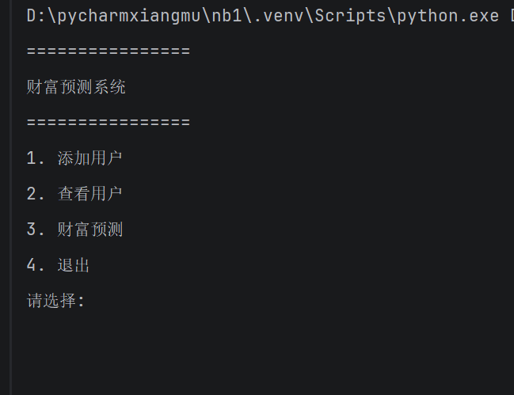
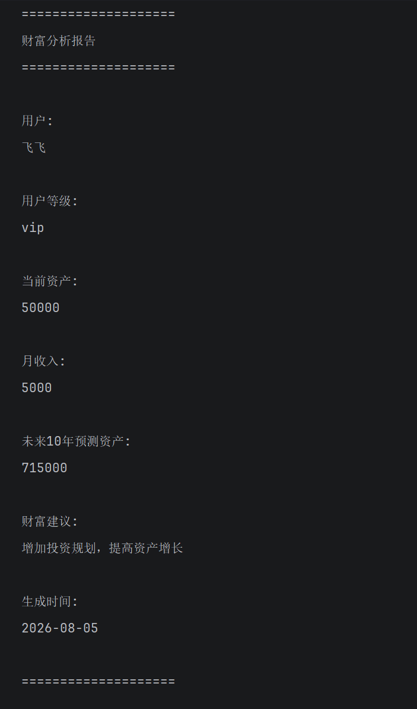

# 🚀 Python AI 90天学习项目


> ✅ **Day1–Day30 第一阶段已完成**
>
> 📦 当前版本：`v1.1`  
> 🧪 已加入自动化测试与 GitHub Actions  
> 🚀 下一阶段：API、Web 后端与 AI 工具开发

## 📌 项目介绍

这是我的 Python + AI 90天学习项目。

通过90天学习，从 Python 基础语法开始，
逐步完成：

- Python基础
- 文件操作
- JSON数据处理
- 面向对象编程
- 项目开发
- Git/GitHub管理


---

# 💰 Wealth Predictor

## 项目简介

Wealth Predictor 是一个个人财富预测与分析系统。

用户可以输入个人财务信息，
系统会保存用户数据，并预测未来财富变化。


## ✨ 功能

### 👤 用户管理

- 添加用户
- 查看用户
- 保存用户数据


### ⭐ VIP用户

- 普通用户 / VIP用户区分
- VIP财富建议
- VIP预测模型


### 📈 财富预测

根据：

- 当前资产
- 月收入

计算：

- 未来10年预测资产


### 📄 自动报告

自动生成财富分析报告：

包含：

- 用户信息
- 用户等级
- 当前资产
- 月收入
- 未来预测
- 财富建议
---

# 🏗 项目结构

```text
python-ai-90days
├── .github
│   └── workflows
│       └── python-tests.yml
│
├── codex90-learning
│   ├── day01
│   ├── day02
│   ├── ...
│   └── day21
│       ├── main.py
│       ├── menu.py
│       ├── user.py
│       ├── vip_user.py
│       ├── users.json
│       ├── requirements.txt
│       │
│       ├── tools
│       │   ├── calculator.py
│       │   ├── database.py
│       │   ├── exceptions.py
│       │   ├── log_config.py
│       │   ├── report.py
│       │   ├── user_factory.py
│       │   ├── user_service.py
│       │   ├── validator.py
│       │   └── wealth_service.py
│       │
│       ├── tests
│       │   ├── test_calculator.py
│       │   ├── test_database.py
│       │   ├── test_report.py
│       │   ├── test_user.py
│       │   ├── test_user_factory.py
│       │   └── test_validator.py
│       │
│       ├── reports
│       └── logs
│
├── LICENSE
└── README.md
```
---

# ▶️ 运行方式
进入项目目录：

```bash
cd codex90-learning/day21
python main.py
```


## 🛠 技术栈
- Python 3.12
- 面向对象编程 OOP
- JSON 数据存储
- 文件读写
- Git
- GitHub


## 📚 学习进度

| 阶段 | 学习内容 | 状态 |
|---|---|---|
| Day1–Day7 | Python 基础、变量、条件判断、函数、模块 | ✅ 完成 |
| Day8–Day12 | 文件读写、JSON、类与对象 | ✅ 完成 |
| Day13–Day20 | 项目拆分、Git、GitHub、代码组织 | ✅ 完成 |
| Day21 | Wealth Predictor 核心项目 | ✅ 完成 |
| Day22 | 项目结构重构与输入验证 | ✅ 完成 |
| Day23 | 虚拟环境与依赖管理 | ✅ 完成 |
| Day24 | `unittest` 自动化测试 | ✅ 完成 |
| Day25 | GitHub Actions 持续集成 | ✅ 完成 |
| Day26 | 分支与 Pull Request 工作流 | ✅ 完成 |
| Day27 | `logging` 日志系统 | ✅ 完成 |
| Day28 | 自定义异常处理 | ✅ 完成 |
| Day29 | JSON 文件容错处理 | ✅ 完成 |
| Day30 | 第一阶段验收与 `v1.1` 发布 | ✅ 完成 |
| Day31–Day60 | API、Web 后端与 AI 工具开发 | 🚧 即将开始 |
| Day61–Day90 | 产品部署、作品集与变现实践 | 📅 计划中 |

## 🏆 Day1–Day30 第一阶段成果

经过前 30 天的学习与实践，已经完成一个具备真实项目结构的
Python 财富预测系统，并走通了基础软件开发流程。

### Python 与项目能力

- 掌握变量、条件判断、函数、模块和面向对象
- 使用 JSON 保存和读取用户数据
- 使用继承实现普通用户与 VIP 用户
- 将菜单、业务逻辑、数据库和验证功能拆分到不同模块
- 使用类型标注改善代码可读性
- 使用自定义异常处理重复用户
- 处理 JSON 文件不存在、为空和格式损坏等情况
- 使用 `logging` 记录程序运行日志

### 自动化测试

项目使用 Python 标准库 `unittest` 编写自动化测试，覆盖：

- 财富计算
- 输入验证
- 普通用户与 VIP 用户
- 用户对象工厂
- JSON 数据存储
- 报告生成
- 异常与边界情况

文件测试使用临时目录运行，不会修改真实的 `users.json`。

### GitHub 工程流程

已经实践：

- Git 分支开发
- Pull Request
- GitHub Actions 自动运行测试
- 代码合并与分支清理
- Git 标签
- GitHub Release

### 当前版本
```
Wealth Predictor v1.1
v1.1 是 Day1–Day30 第一阶段的稳定版本。
```
---

## 📷 项目截图

### 1. 程序运行界面

用户可以通过菜单选择：

- 财富分析
- 查看历史记录
    




### 2. 财富分析报告


系统自动生成财富预测报告：

包含：

- 用户等级
- 当前资产
- 月收入
- 未来10年预测资产
- 财富建议



---

## 🚀 后续计划

- Day22-Day30 项目优化
- 增加数据可视化
- 学习 API 调用
- 接入 AI 模型
- 开发更多 Python 自动化项目


## 👨‍💻 作者
飞飞

---