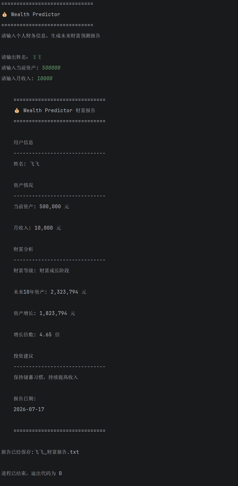

# 💰 Wealth Predictor

> 一个基于 Python 的个人财富预测与分析系统  
> 通过输入个人资产、收入等财务信息，分析当前财富阶段，并预测未来资产增长趋势。


---

通过输入个人资产、收入等财务信息，
分析当前财富阶段，并预测未来资产增长趋势，
帮助用户建立长期财富规划意识。


## ✨ 项目简介

Wealth Predictor 是一个使用 Python 开发的个人财富分析工具。

项目通过模块化设计，将财富等级分析、
未来资产预测、投资建议生成以及报告输出等功能进行整合。
---

## ✅ 功能特点

- 💰 财富等级分析
- 📈 未来资产增长预测
- 🧮 财富增长计算
- 💡 投资建议自动生成
- 📄 自动生成个人财富报告
- 🏗️ 模块化项目结构设计

---
---

## 📸 项目展示

程序运行效果如下：

该程序通过用户输入个人财务信息，
自动生成财富分析结果和未来资产预测报告。


<p align="center">



</p>

## 🚀 核心功能

目前已实现以下功能：

✅ 用户财务信息输入

✅ 财富等级判断

✅ 财富成长阶段分析

✅ 未来资产增长预测

✅ 资产增长金额计算

✅ 财富增长倍数分析

✅ 投资建议生成

✅ 自动生成个人财富分析报告


---

# 📂 项目结构

项目采用模块化设计，将不同功能拆分为独立模块，
提高代码可读性和可维护性。
```text
WealthPredictor
│
├── main.py                  # 程序入口
│
├── tools                    # 功能模块
│   │
│   ├── __init__.py          # 模块初始化
│   │
│   ├── calculator.py        # 基础计算模块
│   │
│   ├── money.py             # 资产增长模型计算
│   │
│   ├── wealth.py            # 财富等级判断模块
│   │
│   ├── advice.py            # 投资建议模块
│   │
│   └── report.py            # 财富报告生成模块
│
├── images
│   │
│   └── demo.png             # 程序运行截图
│
└── README.md
```

# 🛠 技术栈

- Python 3.12

- 模块化程序设计

- 函数封装与代码复用

- 文件读写与数据持久化

- 财务数据计算模型

- 用户交互设计

- 项目结构化开发

- Git 版本管理

# 🚀 使用方法


### 环境要求

- Python 3.12
- Windows / macOS / Linux

## 运行项目

进入项目目录:

```bash
cd WealthPredictor
```

运行：
```bash
python main.py
```

### 示例输入
```
请输入姓名:
飞飞

请输入当前资产:
500000

请输入月收入:
10000
```
### 示例输出
```
财富等级:
财富成长阶段

10年后预计资产:
2323794 元

资产增长:
1823794 元

增长倍数:
4.65 倍

投资建议:
保持储蓄习惯，持续提高收入
```

## 🚀 未来规划

未来计划持续升级 Wealth Predictor，使其逐步发展为智能化个人财富分析系统：

- 🤖 接入 AI 财务分析模型
- 📊 增加数据可视化图表
- 🌐 开发 Web 在线版本
- 🗄️ 增加数据库用户数据管理
- 💡 优化智能投资建议系统
- 📱 开发移动端财富管理助手


## 👨‍💻 作者

飞飞

Python 学习者，专注 AI 工具开发与个人项目实践。


## 📄 License

This project is licensed under the MIT License.